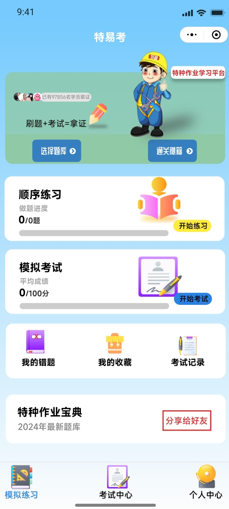
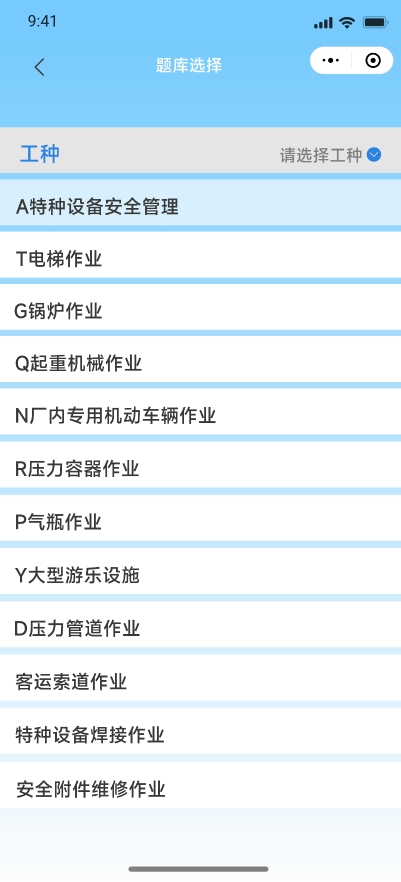
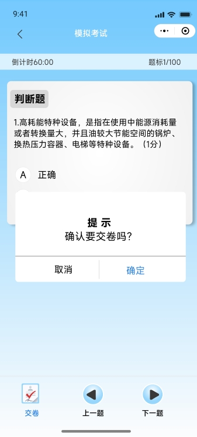
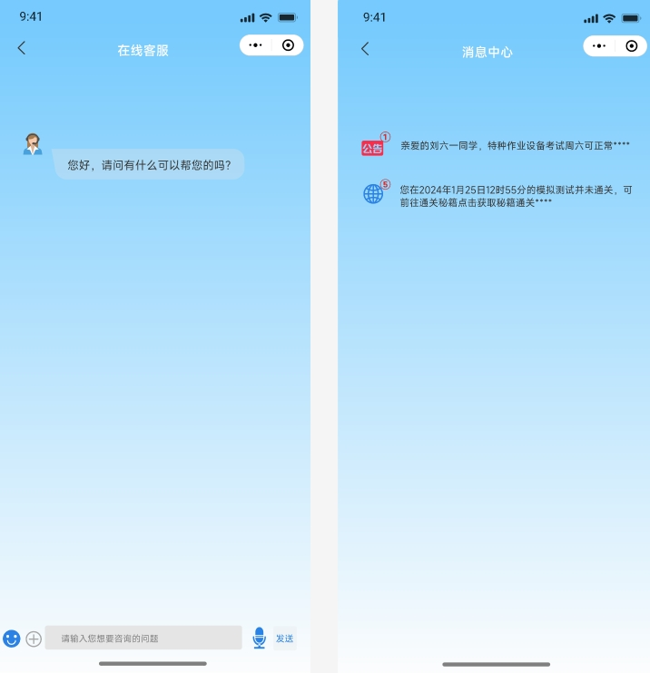

<<<<<<< HEAD
# 特易考小程序（考试刷题）
##  :star2:  :star2:  :boom: 技术栈---
 
### 前端:uniapp(vue3)  
### 后端:node.js(egg)+redis
[schedule定时器/用于模拟考试监控时间]
[sequelize ORM操作mysql数据库]

### tb_users 用户表
### tb_questions 题库表
### tb_options 选项表
### tb_records 做题记录表
### tb_work_types 工种类型表
### tb_wrong_lists 错题表
### tb_collections 收藏表
### tb_exams 考试表
### tb_user_exam_records 用户考试记录表

# 使用说明
- `npm install`
- `npm run dev`

# 测试环境baseURL
- `http://localhost:7001/`

# 特易考 - API接口文档

## 用户接口
- `POST /api/user/WXlogin` - 微信授权登陆（登陆注册集成）

## 题目接口
- `POST /api/question/getUserDoQuesitonByCode` - 选择城市和工种获取数据
- `POST /api/question/doneAnswer` - 用户点击选项
- `POST /api/question/getNextQuestion` - 用户点击下一题，获取下一题的题目
- `POST /api/question/getPreviousQuestion` - 用户点击上一题，获取上一题的题目

## 模拟考试接口
- `POST /api/exam/gotoExam` - 点击模拟考试，获取80道题目
- `POST /api/exam/doExamAnswer` - 模拟题点击选项
- `POST /api/exam/submitExam` - 提交模拟考试

## 工种接口
- `GET /api/workType/getWorkTypeList` - 获取工种列表

## 错题接口
- `POST /api/wrong/getWrongNextQuestion` - 获取下一道错题
- `POST /api/wrong/getWrongPreviousQuestion` - 获取上一道错题
- `POST /api/wrong/doWrongAnswer` - 点击错题选项
- `POST /api/wrong/deleteWrongQuestion` - 删除错题记录

## 收藏接口
- `POST /api/collection/collectQuestion` - 用户收藏题目
- `POST /api/collection/getNextCollectQuestion` - 用户获取下一道收藏题目
- `POST /api/collection/getPreviousQuestion` - 用户获取上一道收藏题目
- `POST /api/collection/doCollectAnswer` - 用户点击收藏题目的选项
- `POST /api/collection/deleteAllCollect` - 用户删除所有收藏题目

# 特易考预览图

